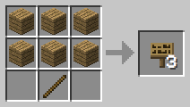

# CoderDojo: Minecraft Moddning

### Nivå 0: CoderDojo – installera Eclipse och dekompilera Minecraft

För att börja modda Minecraft behöver du ha en ren Minecraft (en Minecraft utan andra moddar).

Du måste ha de här programmen installerade:

* JDK (Java Developer Kit)
* JRE (Java Runtime Environment) -- du har säkert redan JRE eftersom det behövs för Minecraft
* Eclipse (en app att programmera i Java)
* MCP (Minecraft Coder Pack)

Du kan du hitta dem på internet, usb stickan eller PirateBoxen.

Efter att ha installerat allt, kan du dekompilera koden.

**Windows**

1. tryck på Kör i Start-menyn
2. skriv `%appdata%` och tryck på Kör
3. kopiera mapparna `minecraft\bin` och `minecraft\resources` till mappen `mcp726a\jars`
4. dubbelklicka på `mcp726a\decompile.bat`

**Mac**

1. gå till `~/Library/Application Support/minecraft`
2. kopiera mapparna `bin` och `resources` till mappen: `mcp726a/jars`
3. kör `Terminal.app`
4. `cd` till `mcp726a`
5. kör `bash decompile.sh`

Om du har problem och behöver installera något annat måste du rensa upp (Windows: `mcp726a\cleanup.bat`, Mac: `mcp726a/cleanup.sh`) innan du kan dekompilera igen.

### Nivå 1: Slime – skapa ett nytt block med ett eget recept

När du kör Eclipse för första gången måste du peka ut var ditt projekt ligger. Gå till `mcp723/eclipse` och tryck på OK.

Minecraft källkoden ligger under `Client/src/net.minecraft.src`. Hitta den på vänster sida av Eclipse i Package Explorer fönstret. Här finns nästan all kod som gör att Minecraft är just Minecraft. Öppna `Block.java`.

`Block.java` är en klass. Det är föräldern till alla andra block som finns i Minecraft.

Hitta raden:

	    public static final Block stone = (new BlockStone(1, 1)).setHardness(1.5F).setResistance(10.0F).setStepSound(soundStoneFootstep).setBlockName("stone");

Det är en deklaration av en typ av block: en sten. Varje block har ditt eget nummer. Sten har numret 1. Vilken block har numret 86?

Eftersom Mojang fortfarande utvecklar Minecraft kan du se att nya block har högre nummer än gamla. När du skapar ditt egna block måste du välja ett nummer inget annat block använder.

**Ditt första block**

Skapa en ny klass. Jag kallar min `BlockExample`, men du kan kalla den vad som helst. Kopiera koden i till ny fil.

	package net.minecraft.src;
	import java.util.Random;

	/* Koden användar namnet BlockExample. Ändra till ditt ett namn du har valt. */

	public class BlockExample extends Block
	{
		public BlockExample(int i, int j)
		{
			super(i, j, Material.rock);
		}

		public int idDropped(int i, Random random)
		{
			return 0;
		}
	}

Kanske såg du att en rad inte är kod utan en vanlig mening. När du programmerar är det en bra idé att kommentera vad du skriver. Om du gör det kan en annan person (eller en äldre dig) läsa koden och förstå bättre vad du menade. Kommentarer i java börjar med `/*` och slutar med `*/`. Om du glömmer starten och/eller slutet på kommentaren kommer inte din kod att fungera.

I filen `Block.java` måste du nu deklarera ditt nya block.

Lägg till den här raden under den sista deklarationen:

	public static final Block example = (new BlockExample(92, 1)).setHardness(1.5F).setResistance(10F).setStepSound(soundStoneFootstep);

Byt namnet `example` och numret `92`. Kommentera vad du har gjort.

Nu är vi redo att köra Minecraft med din mod. Spara allt och klicka på 'Run'.

Börja en ny Creative värld med Cheat mode aktiverat.

Kör kommandot:

    /give Player 92 64

Istället för `Player` använd ditt spelarnamn (skriv `P` och tryck tab) och istället för `92` använd blocknumret.

Om allt fungera bra har du nu ditt nya block.

Försök att göra ditt block hårdare. Försök att göra ditt block oförstörbart (tips: vilket block är redan oförstörbart?).

**Blockrecept**

Nu kan vi börja ge ditt block ett recept.

Öppna filen `CraftingManager.java` i Eclipse.

Gå till raden:

	this.addRecipe(new ItemStack(Item.sign, 3), new Object[] {"###", "###", " X ", '#', Block.planks, 'X', Item.stick});

Här finns all information vi behöver för att skapa en skylt i Minecraft. Fundera på hur man gör det i gör det i Crafting lådan i Minecraft.

I första raden behöver man tre plankor. I andra behöver man också tre plankor. I den tredje behöver man bara en pinne med tomrum på båda sidorna. Titta på koden och fundera på hur det fungerar (tips: `#` betyder planka och `X` pinne)

Observera att skylt och pinne inte är `Block` utan `Item`. Det är en viktig skillnad. Vad mer kan vara `Item` i Minecraft?

Lägg till den här raden under sista receptet:

	addRecipe(new ItemStack(Block.example, 1), new Object[] {"# #", " # ", "# #", '#', Block.dirt});

Ändra namnet `example`. Kommentera vad du har gjort.

Vad är receptet här? Skriv det på en lapp.

Spara koden och kör Minecraft. Se om du kan crafta fram ditt block utan att fuska.

Ändra receptet till något med två block. Gör ett recept med item.

### Nivå 2: Blaze – skapa ett nytt vapen med en egen textur
### Nivå 3: Creeper – skapa en egen NPC med ett eget ljud
### Nivå 4: Steve – hjälp en annan person till Creeper nivån
### Nivå 5: Ender Dragon – gör din eget mod och ladda upp det till ett Minecraft forum
